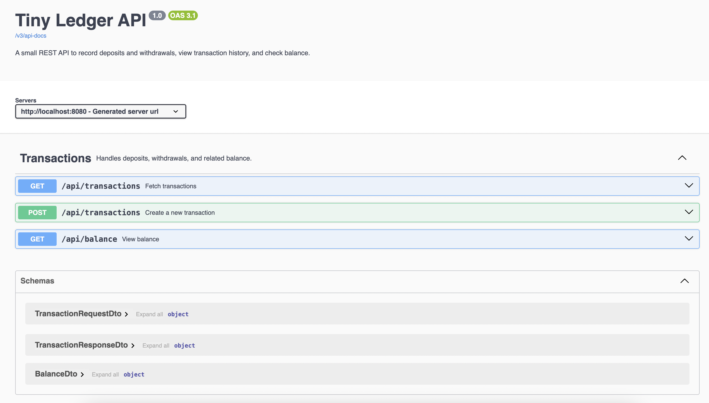

# Tiny Ledger API

A small REST API to record deposits and withdrawals, view transaction history, and check balance.

This project uses **Maven** and is implemented in **Java 21** using **Spring Boot** and **Spring Web MVC**.
It uses an **in-memory repository**, so no database setup is required.

## Assumptions

- Only **one user** and **one account** are supported.
- Transactions are stored in **Euros**, with **two decimal places**.
- All transaction amounts are **positive**; withdrawals are treated as negative for balance calculation.
- **Negative balances are allowed**; no validation is performed to prevent overdrafts.
- Timestamps are stored in **UTC**. Similarly, the API only supports UTC. If no timestamp is given for a transaction,
  current UTC time will be used.
- Transactions with timestamps in the future are not allowed.
- Transactions can be added retroactively, even when a more recent transaction already exists.
- Only one transaction can be created at a time.

## Build & Run

### Requirements

To run this application using the Maven Wrapper (`mvnw` / `mvnw.cmd`), you need **Java JDK 21 or higher** installed.

No global Maven installation is required.

### Using Maven Wrapper

In the project folder, run through the terminal:

```bash
# Build the project
./mvnw clean package

# Run the application
./mvnw spring-boot:run
```

The API will be available at `http://localhost:8080/api`.

Windows users should use `.\mvnw.cmd` instead of `./mvnw`.

### Swagger UI

Interactive API documentation will be available at:

```
http://localhost:8080/swagger-ui.html
```



## API Endpoints

All features can be tried out using Swagger UI or through the terminal using `curl` commands.
Examples of `curl` commands will be provided below.

### 1. Record money movements (ie: deposits and withdrawals)

**POST** `/transactions`

**Request Body Example (to record a deposit):**

```
{
  "type": "DEPOSIT",
  "description": "Salary",
  "amount": 150.00,
  "occurredAt": "2025-08-23T15:03:00Z"
}
```

**Request Body Example (to record a withdrawal):**

```
{
  "type": "WITHDRAWAL",
  "description": "Groceries",
  "amount": 37.55,
  "occurredAt": "2025-08-23T18:10:00Z"
}
```

**Response:** Returns the created transaction with a generated `id`.

**How to run using `curl`:**

```
curl -X 'POST' \
  'http://localhost:8080/api/transactions' \
  -H 'accept: application/json' \
  -H 'Content-Type: application/json' \
  -d '{
  "type": "DEPOSIT",
  "description": "Salary",
  "amount": 150.00,
  "occurredAt": "2025-08-23T15:03:00Z"
}'
```

### 2. View current balance

**GET** `/balance`

**Response Example:**

```
{
  "balance": 262.45
}
```

**How to run using `curl`:**

```
curl -X 'GET' \
  'http://localhost:8080/api/balance' \
  -H 'accept: application/json'
```

### 3. View transaction history

**GET** `/transactions`

Supports optional parameters `from` and `to`:

**GET** `/transactions?from=2025-08-22T12:00:00Z&to=2025-08-24T20:00:00Z`

**Response Example:**

```
[
  {
    "id": "5c89ee7d-66f5-4421-8df6-037aa185d45f",
    "type": "WITHDRAWAL",
    "description": "Groceries",
    "amount": 37.55,
    "occurredAt": "2025-08-23T18:10:00Z"
  },
  {
    "id": "0c838221-d371-4a60-bafd-483c71d87db2",
    "type": "DEPOSIT",
    "description": "Salary",
    "amount": 150,
    "occurredAt": "2025-08-23T15:03:00Z"
  }
]
```

**How to run using `curl`:**

Without optional parameters:

```
curl -X 'GET' \
  'http://localhost:8080/api/transactions' \
  -H 'accept: application/json'
```

With optional `from` and `to` parameters:

```
curl -X 'GET' \
  'http://localhost:8080/api/transactions?from=2025-08-22T12:00:00Z&to=2025-08-24T20:00:00Z' \
  -H 'accept: application/json'
```

## Testing

Unit tests are included for the service layer, using the provided in-memory repository instead of a mock.

Run tests with:

```
./mvnw test
```
